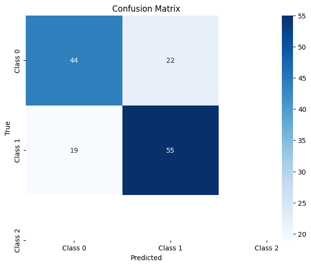
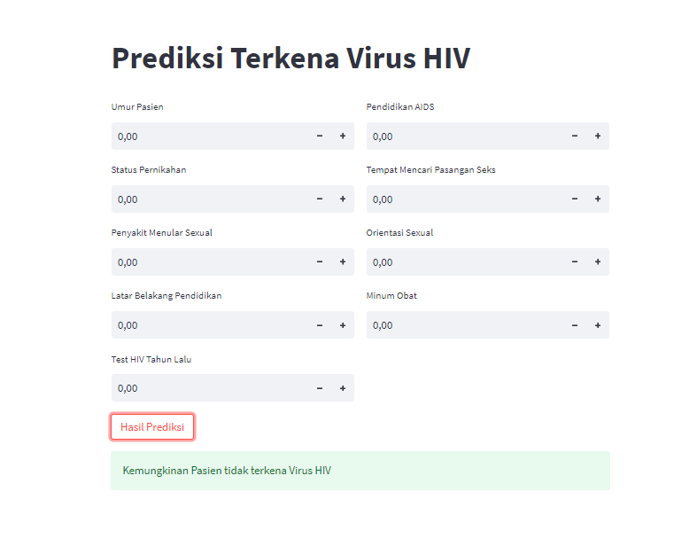

# Laporan Proyek Machine Learning
### Nama : Fauzan Musyaffa
### Nim : 211351158
### Kelas : Malam B

## Domain Proyek
Proyek ini bertujuan untuk memprediksi dan menganalisis terkait dengan HIV. Data yang digunakan mencakup informasi tentang pasien, seperti riwayat medis, faktor-faktor risiko, dan hasil tes terkait dengan HIV. Tujuan dari proyek ini adalah untuk mengembangkan model prediksi yang dapat membantu menentukan risiko terjangkitnya HIV pada pasien. Analisis ini bertujuan untuk memahami faktor-faktor yang berkontribusi terhadap risiko HIV, dan untuk memprediksi kemungkinan terjangkitnya HIV berdasarkan data pasien. Hasil dari proyek ini dapat membantu dalam upaya pencegahan dan pengelolaan HIV, serta meningkatkan pemahaman tentang faktor-faktor risiko yang berhubungan dengan penyebaran virus HIV.

## Business Understanding
Pada langkah ini, kita perlu paham hal-hal penting terkait prediksi HIV, termasuk faktor-faktor risiko yang mempengaruhi penyebaran penyakit ini, serta tanda-tanda atau hasil tes yang bisa dipakai untuk menebak kemungkinan seseorang terinfeksi HIV. Selain itu, penting juga untuk memahami bagaimana data kesehatan dan informasi yang relevan tentang pasien dapat dimanfaatkan untuk menciptakan model prediksi yang akurat. Proyek ini bertujuan membuat model prediksi yang bisa membantu dalam usaha pencegahan dan pengelolaan HIV, terutama dalam mendiagnosis dini dan menentukan risiko individu tertular HIV.

### Problem Statements
- Membuat suatu sistem yang bisa menebak kemungkinan seseorang tertular HIV berdasarkan informasi kesehatan dan faktor-faktor risiko yang penting. Tujuannya adalah untuk mengetahui risiko seseorang sejak dini dan mencegah penyebaran HIV dengan lebih efektif.
 ### Goals
 - Tujuan dari proyek ini adalah untuk mengembangkan model prediksi yang sangat tepat dalam menilai risiko individu terjangkit HIV berdasarkan data medis dan faktor-faktor risiko yang signifikan. Model ini akan digunakan untuk melakukan identifikasi dini risiko individu terjangkit HIV, memberikan panduan bagi tindakan pencegahan yang lebih tepat sasaran, dan meningkatkan pemahaman tentang faktor-faktor risiko yang memengaruhi penyebaran virus HIV.

  ### Solution statements
Pengembangan model prediksi ini bertujuan untuk menggabungkan informasi medis dan faktor-faktor risiko individu guna memprediksi kemungkinan terjangkit HIV. Dengan memanfaatkan algoritma machine learning dan data pasien, model ini dirancang untuk memberikan prediksi yang dapat diandalkan. Tujuan solusi ini adalah menyediakan alat yang dapat mendukung identifikasi dini risiko terjangkit HIV pada individu, sehingga memungkinkan pencegahan yang lebih efektif. Selain itu, kontribusinya diharapkan dapat meningkatkan pemahaman kita tentang cara mengendalikan penyebaran virus HIV.

  ## Data Understanding
 Dalam tahap ini, kita melakukan analisis dasar untuk proyek penelitian dengan merangkum dan mengidentifikasi potensi masalah dalam data yang kita dapatkan untuk Prediksi HIV.

  https://www.kaggle.com/datasets/ishigamisenku10/hiv-prediction

  ### Variabel-variabel pada HIV Prediction adalah sebagai berikut:
 1. Age = int64 
 2. Marital Staus = object
 3. STD = object
 4. Educational Background = object
 5. HIV TEST IN PAST YEAR = object
 6. AIDS education = object
 7. Places of seeking sex partners = object
 8. SEXUAL ORIENTATION =  object
 9. Drug- taking =  object
 10. Result = object
 
## Data Preparation
### Data Collection

Informasi yang telah dikumpulkan melibatkan data medis yang berharga, termasuk catatan mengenai riwayat penyakit, faktor-faktor risiko, dan hasil tes terkait HIV. Data ini diperoleh dari berbagai lembaga medis dan rumah sakit yang mencatat informasi medis para pasien. Pentingnya data ini terletak pada peran utamanya dalam usaha untuk mengidentifikasi secara dini serta memahami lebih lanjut tentang faktor-faktor yang mempengaruhi penyebaran dan risiko penularan virus HIV.

### Data Discovery And Profiling
Pertama kita harus mengimport library yang dibutuhkan 
``` bash
import numpy as np
import pandas as pd
import matplotlib.pyplot as plt
import seaborn as sns
import pickle
from sklearn.model_selection import train_test_split
from sklearn.neighbors import KNeighborsClassifier
from sklearn.preprocessing import LabelEncoder
from sklearn.metrics import classification_report
from sklearn.metrics import confusion_matrix
```
disini kita akan memasukan dataset dan melihat data sample
```bash
df = pd.read_csv('HIV_dataset.csv')
df.sample()
```
selanjutnya melihat type data yang digunakan
``` bash
df.info()
```
Kode program ini berfungsi untuk mengelompokkan kolom dalam sebuah DataFrame (dianggap sebagai df) menjadi dua jenis, yakni kolom numerik dan kolom kategori. Selanjutnya, program ini juga mengisi nilai yang hilang (NaN) dalam kedua jenis kolom tersebut.
``` bash
numerical = []
catgcols = []

for col in df.columns:
if df[col].dtype=="int64":
numerical.append(col)
else:
catgcols.append(col)

for col in df.columns:
if col in numerical:
df[col].fillna(df[col].median(), inplace=True)
else:
df[col].fillna(df[col].mode()[0], inplace=True)
```
``` bash
numerical
```
``` bash
catgols
```
Di sini, kita akan menghitung seberapa sering setiap nilai unik muncul dalam kolom 'Result' dari DataFrame 'df'.
``` bash
df['Result'].value_counts()
```
selanjutnya menggantikan nilai "Positive" dengan "POSITIVE" dalam kolom 'Result' dari sebuah DataFrame (diasumsikan menggunakan library seperti pandas dalam Python) dan kemudian menghitung jumlah kemunculan setiap nilai dalam kolom 'Result' yang sudah diubah.
``` bash
df['Result'] =df['Result'].replace(['Positive'],'POSITIVE')
```
``` bash
df['Result'].value_counts()
```
lalu mengganti nilai "Negative" dalam kolom 'Result' DataFrame 'df' dengan nilai "NEGATIVE", dan kemudian menghitung jumlah kemunculan setiap nilai dalam kolom 'Result' yang sudah diubah
``` bash
df['Result'] =df['Result'].replace(['Negative'],'NEGATIVE')
```
``` bash
df['Result'].value_counts()
```
saya akan menentukan kolom independen (ind_col) dan kolom dependen (dep_col) dalam sebuah DataFrame.
``` bash
ind_col = [col for col in df.columns if col != 'Result']
dep_col = 'Result'
```
``` bash
df[dep_col].value_counts()
```

ini adalah sebuah plot countplot pertama yang menunjukkan distribusi jumlah pengamatan untuk setiap nilai dalam kolom "Result" dari DataFrame df.
``` bash
plt.figure(figsize=(15,6))
sns.countplot(data=df, x="Result")
```
 <br>

ini adalah membuat plot countplot ke dua yang menggambarkan distribusi hasil ("Result") berdasarkan tempat mencari pasangan seks ("Places of seeking sex partners") 
``` bash
plt.figure(figsize=(15,6))
sns.countplot(data=df, x="Result", hue="Places of seeking sex partners")
```
 <br>
ini adalah plot countplot ke tiga yang menunjukkan distribusi jumlah pengamatan untuk setiap kategori pada sumbu x ("Result"), dengan membedakan berdasarkan nilai kolom "STD". Plot ini bermanfaat untuk melihat pola distribusi dan hubungan antara dua variabel kategorikal.
``` bash
plt.figure(figsize=(15,6))
sns.countplot(data=df, x="Result", hue="STD")
```
 <br>
disini kita membuat sebuah countplot ke empat yang menunjukkan distribusi jumlah observasi (count) untuk setiap nilai pada kolom "Result" dalam DataFrame df, dengan pemisahan berdasarkan kategori "SEXUAL ORIENTATION". Plot ini berguna untuk memahami sebaran data dan hubungan antara variabel "Result" dan "SEXUAL ORIENTATION".
``` bash
plt.figure(figsize=(15,6))
sns.countplot(data=df, x="Result", hue="SEXUAL ORIENTATION")
```
 <br>
yang terakhir adalah plot bar yang menunjukan hubungan antara variable "Result" dan "Age" dari DataFrame df.
``` bash
plt.figure(figsize=(15,6))
sns.catplot(data=df, kind="bar", x="Result", y="Age")
```
 <br>
Selanjutnya saya akan melalukan preprocessing data
lalu mengubah nilai-nilai kategorikal menjadi angka, sehingga data dapat digunakan dalam model-machine learning yang memerlukan input numerik
``` bash
le = LabelEncoder()
for col in catgcols:
df[col] =le.fit_transform(df[col])
```

``` bash
df['Result'] = le.fit_transform(df['Result'])
```

``` bash
x = df[ind_col]
y = df[dep_col]
```
lalu menampilkan 5 df setelah proses encoding selesai
``` bash
df.head()
```

## Modeling
Pada tahap ini kita akan melatih model yang akan kita gunakan ,disini saya menggunakan model KNN(K-Nearest Neighbors (KNN)
``` bash
x_train, x_test, y_train, y_test = train_test_split(x, y, test_size=0.20, random_state=0)
```
``` bash
model1=KNeighborsClassifier(n_neighbors=3)
model1.fit(x_train,y_train)
y_pred1=model1.predict(x_test)
y_true = y_test
```

## Evaluasi
disini kita akan melakukan prediksi apakah model yang sudah kita latih berfungsi
``` bash
input_data = (22,5,0,0,1,0,0,2,2)

input_data_as_numpy_array = np.array(input_data)

input_data_reshape = input_data_as_numpy_array.reshape(1, -1)

prediction = model1.predict(input_data_reshape)
print(prediction)

if (prediction[0]==1):
    print ('Pasien tidak terkena HIV')
else:
    print ('Pasien terkena HIV')
```
disini kita akan membuat visualisasi Confusion Matrix dan akurasi model yang dihasilkan
``` bash
score = model1.score(x_test, y_test)
print('akurasi model knn = ', score)
print("Confusion Matrix:")
print(confusion_matrix(y_true, y_pred1))
print("\nClassification Report:")
print(classification_report(y_true, y_pred1))
```
akurasi model knn =  0.7071428571428572<br>
Confusion Matrix:<br>
[[44 22]<br>
 [19 55]]
 ``` bash
cm = confusion_matrix(y_true, y_pred1)
plt.figure(figsize=(8, 6))
sns.heatmap(cm, annot=True, fmt='g', cmap='Blues', xticklabels=['Class 0', 'Class 1', 'Class 2'], yticklabels=['Class 0', 'Class 1', 'Class 2'])
plt.xlabel('Predicted')
plt.ylabel('True')
plt.title('Confusion Matrix')
plt.show()
```
 <br>

## Deployment

  [App](https://uasmachinelearning-78ixbbxhhnarjvyleammrh.streamlit.app/)

  
